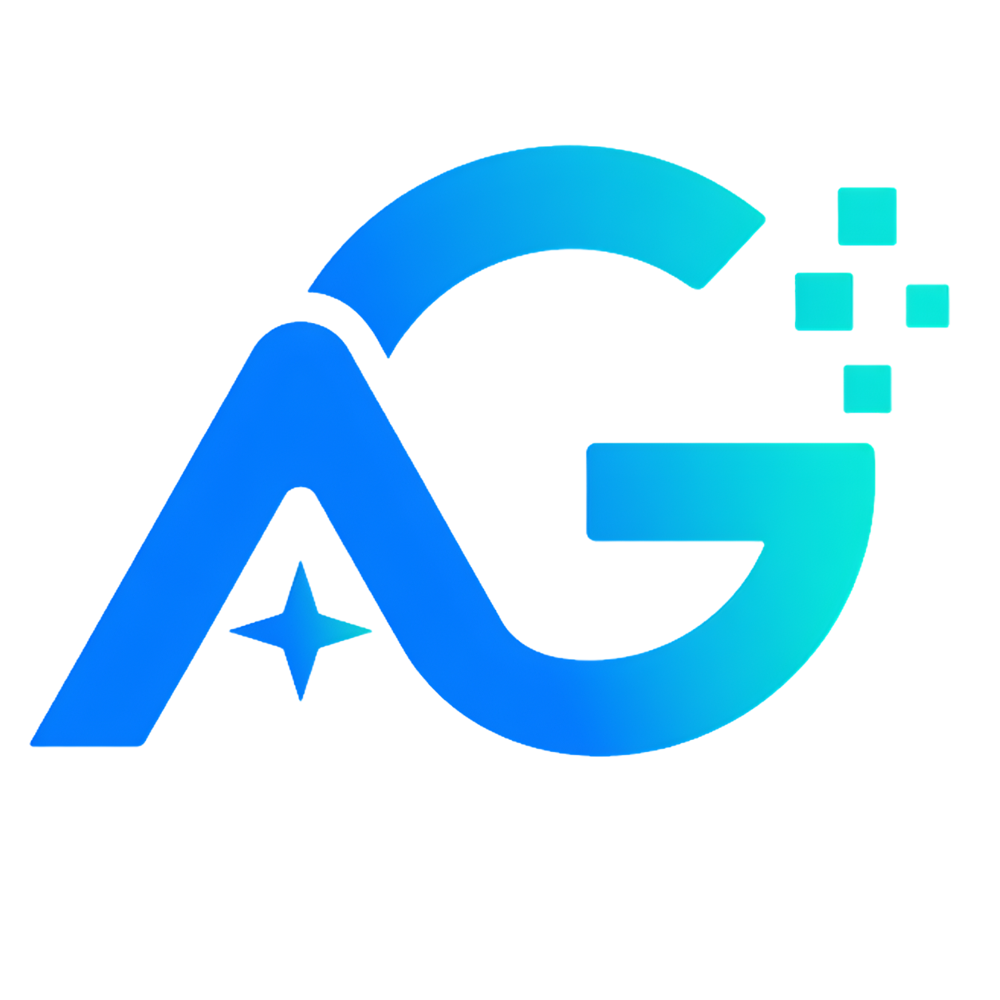

  
  &nbsp;&nbsp;&nbsp;&nbsp;&nbsp;&nbsp;&nbsp;&nbsp;&nbsp;&nbsp;&nbsp;&nbsp;&nbsp;&nbsp;&nbsp;&nbsp;&nbsp;&nbsp;&nbsp;&nbsp;&nbsp;&nbsp;&nbsp;&nbsp;
  

  🇻🇳 <a href="./README.md">Tiếng Việt</a> | 🇺🇸 <b>English</b>

---

# Road to AI (R2AI) – Stage 2

## 1. Introduction

**Road to AI (R2AI)** is an AI Engineering competition and community in Vietnam organized by **AI Guru**, aiming to encourage the development of AI products that can be applied in real business environments. **R2AI – Stage 2** presents the challenge of **Text-to-Pandas – Financial Report Querying & Analysis Assistant**, focusing on financial table retrieval and pandas query generation for Vietnamese financial question answering.

### Problem Context

Investors, analysts, and businesses in Vietnam often spend significant time manually looking up financial indicators such as revenue, profit, ROE, ROA, debt-to-equity ratio, and growth across periods. These figures are often scattered across many tabular financial reports of listed companies over multiple years.

The Text-to-Pandas AI Assistant is designed to automate the retrieval, aggregation, and calculation of financial indicators from original financial report data. With the rapid development of large language models such as ChatGPT, DeepSeek, and Qwen, building systems that can convert natural-language questions into table-data queries has become increasingly important, especially for Vietnamese financial data.

The competition focuses on **Financial Table Retrieval & Text-to-Pandas Query Generation** over financial reports of listed companies. Systems are expected to identify relevant tables, generate executable pandas code, calculate correct answers, and provide clear evidence for verification.

### Table Retrieval

Table Retrieval is the task of identifying which tables in the financial report corpus are most relevant to a given question. Given a set of questions $Q = \{q_1, q_2, ..., q_n\}$ and a corpus of financial reports $D = \{d_1, d_2, ..., d_n\}$, where each report contains multiple tables such as balance sheets, income statements, cash flow statements, and notes to financial statements, the system must identify the relevant subset of tables $D' \subset D$ containing the figures needed to compute the answer.

### Text-to-Pandas

Based on the retrieved tables, the system needs to generate pandas code that can be executed on standardized data to compute and return the correct numerical answer for the corresponding financial question. The goal is not only to retrieve the correct tables, but also to understand the financial calculation logic, schema, units, and reporting period.

### Competition Goals

Competing teams need to build AI systems capable of:

1. **Accurate Data Retrieval**:
   * Identify the correct company, year, and data table containing the required figures.
   * Accurately search and retrieve table positions from the financial report corpus.
   * Prioritize retrieval and grounding accuracy over tabular data.
2. **Vietnamese Financial Query Understanding**:
   * Understand Vietnamese natural-language questions about financial indicators and terminology.
   * Handle questions involving multiple companies, multiple years, or derived metrics such as ROE, ROA, and growth.
3. **Pandas Query Generation & Accurate Calculation**:
   * Generate executable pandas code with correct logic and schema usage.
   * Return correct figures with correct units and reporting periods.
4. **Transparent Citation**:
   * Cite the company, year, report name, table name, and source position of the original data.
   * Clearly display references to ensure verifiability.
   * Minimize answers that lack data grounding.
5. **Control Misleading Content**:
   * Reduce hallucinated financial figures.
   * Avoid fabricating non-existent tables or sources.
   * Improve answer reliability based on the provided data.

---

## 2. Competition Results & Team List

Below is the list of teams at R2AI Stage 2, along with links to the code and data collected in this repository:

| Award | Team | Project Directory |
| :--- | :--- | :--- |
| 🥇 **First Prize** | LASTDANCE | [lastdance](./lastdance) |
| 🥈 **Second Prize** | ARCANE | [arcane](./arcane) |
| 🥉 **Third Prize** | KINGPRO | [kingpro](./kingpro) |
| 🏅 **Consolation Prize** | SYNERA | [synera](./synera) |
| 🏅 **Consolation Prize** | VILAMIU | [vilamiu](./vilamiu) |
| 🏅 **Consolation Prize** | Nguyễn Vũ Hoàng Long | [nguyenvuhoanglong](./nguyenvuhoanglong) |
| 🏅 **Consolation Prize** | OVERFITTING | [overfitting](./overfitting) |
| 🏅 **Consolation Prize** | IDIOT | [idiot](./idiot) |
| 🏅 **Consolation Prize** | AISOLO | [aisolo](./aisolo) |

*Each team's folder has been collected into a unified structure, with `src` containing the team's original source code. Additional data, artifacts, or documents are kept only when they are included in the provided source package.*

---

## 3. Organizing Committee Contacts

**AI Guru – Dagoras Technology and Communications Joint Stock Company**

* **Address**: 8th Floor, No. 80 Duy Tan, Cau Giay, Hanoi
* **Contacts**:
  * **Nguyen Thi Minh Nguyet**: Phone: `0981544974` | Email: `nguyetntm@dagoras.io`
  * **Vu Thi Thuy Linh**: Phone: `0961891198` | Email: `linhvtt@dagoras.io`
* **Website**: [r2ai.aiguru.com.vn](https://r2ai.aiguru.com.vn)
