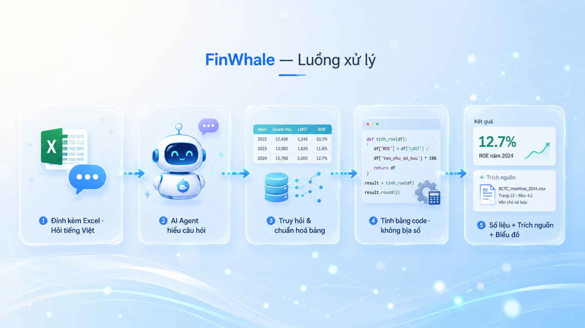

<div align="center">


# 🐳 FinWhale — Trợ lý Phân tích Báo cáo Tài chính bằng AI

**Hỏi bằng tiếng Việt, nhận số liệu tài chính chính xác — kèm nguồn dẫn và truy vấn Pandas.**

Text-to-Pandas trên báo cáo tài chính · Dashboard phân tích tự động · Chống "bịa số"

<sub>Bài dự thi <b>Road to AI (R2AI) — Stage 2</b> · Team <b>AI SOLO</b></sub>

</div>

---

## 📦 Nộp bài — chỉ mục tài liệu thuyết minh

> Mục này gom đúng bốn hạng mục Ban tổ chức yêu cầu, để người chấm không phải dò trong repo.

### 1. Dữ liệu

| Mục | Nội dung |
|---|---|
| Nguồn | **ViFinQA** (bản public của BTC): 1.973 báo cáo tài chính OCR của 100 doanh nghiệp niêm yết, 2015–2025, kèm 1.012 câu hỏi tiếng Việt |
| Cấu trúc | `financial_statements/<MÃ_CK>/<năm>/<hợp nhất\|riêng>/*.txt` · `questions/questions.jsonl` · `code_stock.csv` |
| Định dạng | Báo cáo: text thuần do OCR (bảng giữ dạng cột căn khoảng trắng). Câu hỏi: JSON Lines, mỗi dòng `{"id", "question"}` |
| Dung lượng | ≈ 371 MB, 1.977 tệp |
| Truy cập | Kho **chính thức của BTC** trên Hugging Face: **[huggingface.co/datasets/AIGuruTinix/ViFinQA](https://huggingface.co/datasets/AIGuruTinix/ViFinQA)** — bản đã dùng ghim tại commit `0450088ab22ec946f04f097586967ca405955b3b` (31/07/2026). Tải: `git clone https://huggingface.co/datasets/AIGuruTinix/ViFinQA` |
| Giấy phép | Corpus OCR nền tảng phát hành theo **CC BY-NC 4.0** (TiniX) — bắt buộc ghi công, phi thương mại |
| Dùng trong repo | Đặt vào `data_vifinqa/` rồi trỏ `VIFINQA_ROOT` tới đó, hoặc trỏ thẳng tới nơi đã giải nén |

### 2. Mô hình & checkpoint

| Vai trò | Mô hình | Ghi chú |
|---|---|---|
| Lập kế hoạch truy vấn (Planner) | **Qwen3.5-4B** (GGUF `Q4_K_M`) qua Ollama | `ollama pull hf.co/unsloth/Qwen3.5-4B-GGUF:Q4_K_M` — 4B ≤ 14B, Apache-2.0 |
| Xếp hạng lại bảng | **Qwen3-Reranker-0.6B** | chạy **ngoại tuyến một lần**, kết quả đóng băng ra `rerank_cache.json` |
| Ứng dụng web FinWhale | **Qwen3.5-4B** — cùng mô hình với Planner | chạy local, không gọi dịch vụ ngoài |

> **Bài nộp chỉ dùng đúng hai mô hình trên.** Trong kho còn `llm_engine.py` và `modaldoc/` — một
> nhánh tuỳ chọn từng thử phục vụ Qwen2.5-14B-Instruct qua vLLM trên Modal. Nhánh đó **tắt mặc
> định** (`USE_LLM=1` mới bật) và **không tham gia** sinh bài nộp; lệnh dựng ở mục 5 không có cờ đó.
> Giữ lại vì nó là một phần lịch sử thử nghiệm, không phải vì đang dùng.

Checkpoint đều là **trọng số công khai trên Hugging Face và KHÔNG fine-tune** — tải bằng đúng tên
model ở trên là ra đúng bản đã dùng, không cần đường link riêng:

- [`unsloth/Qwen3.5-4B-GGUF`](https://huggingface.co/unsloth/Qwen3.5-4B-GGUF) (bản lượng tử `Q4_K_M`)
- [`Qwen/Qwen3-Reranker-0.6B`](https://huggingface.co/Qwen/Qwen3-Reranker-0.6B)

Ba tệp kết quả trung gian sinh từ model — `agent_full_v2.json`, `rerank_cache.json`,
`agent_audit.json` (tổng **575 KB**) — **kèm sẵn trong repo**, nên người chấm dựng lại được bài nộp
**chỉ bằng CPU** mà không phải tải gì thêm. Cách tự sinh lại chúng (cần GPU, nhiều giờ) mô tả trong
[`pipeline/README.md`](pipeline/README.md). Cấu hình phục vụ vLLM: [`modaldoc/`](modaldoc).

### 3. Mã nguồn & phụ thuộc

| Thành phần | Vị trí | Phụ thuộc |
|---|---|---|
| Pipeline sinh bài nộp | [`pipeline/`](pipeline) | [`pipeline/requirements.txt`](pipeline/requirements.txt) — Python 3.11.0 |
| Ứng dụng web FinWhale | [`r2ai-app/`](r2ai-app) | [`r2ai-app/package.json`](r2ai-app/package.json) — Node.js 24.18.0, pnpm (khoá bản trong `pnpm-lock.yaml`); Next.js 16.2.11, React 19.2.4 |
| Cấu hình vận hành | `r2ai-app/.env.example` → sao thành `.env.local` | xem mục *Cài đặt & Chạy* bên dưới |

### 4. Bài nộp

Nằm tại [`pipeline/submission_out/`](pipeline/submission_out): `submission.json` (1.012 mục) và
`data/*.csv` (1.069 bảng). Mỗi CSV là **tập con trích từ đúng một bảng nguồn của BTC**, tên tệp
`<tên_báo_cáo>_table_<số_bảng>.csv` truy vết thẳng về báo cáo và số hiệu bảng.

Mọi `pandas_query` **tính trực tiếp từ CSV lúc thực thi** — không có mục nào gán cứng kết quả.
Kiểm tự động (`python pipeline/verify_submission.py`): **1005/1005** truy vấn chạy được và ra đúng
`answer`, 0 mismatch. **Bảy** mục còn lại (id 382, 412, 464, 764, 783, 792, 808) là câu điều kiện
toàn kho mà pipeline không định vị được doanh nghiệp nguồn, nên **để trống cả `pandas_query` lẫn
`evidence` thay vì bịa một bảng chứng cứ**. Ban tổ chức đã xác nhận bằng văn bản (22/08/2026) rằng
đây là cách xử lý đúng, và nói rõ không cần tạo CSV giả hay dùng bảng không đúng nguồn để lấp.

Chống ảo giác số ở tầng thiết kế: prompt gửi LLM **không chứa bất kỳ giá trị số nào** — chỉ có tên
cột, danh sách công ty, năm và nhãn chỉ tiêu; LLM sinh biểu thức trỏ vào `df1`, số do Pandas đọc từ
CSV. Đây là *Numeric Masking* (FinQA, EMNLP 2021) ở dạng triệt để, và là lý do không mục nào có thể
vi phạm quy định cấm gán cứng.

### Chạy lại từ đầu

```bash
# 1) Môi trường Python
python -m venv .venv && .venv/Scripts/activate     # Windows
pip install -r pipeline/requirements.txt

# 2) Tải dữ liệu BTC rồi trỏ VIFINQA_ROOT tới đó
git clone https://huggingface.co/datasets/AIGuruTinix/ViFinQA data_vifinqa
export VIFINQA_ROOT="$PWD/data_vifinqa"            # PowerShell: $env:VIFINQA_ROOT="$PWD\data_vifinqa"

# 3) Dựng lại bài nộp — chỉ CPU, vài phút
USE_AGENT=1 AGENT_OUT=agent_full_v2.json python pipeline/build_submission.py

# 4) Kiểm chứng
python pipeline/verify_submission.py               # kỳ vọng: 1005/1005 khớp, 0 mismatch
```

### Chạy ứng dụng web với dữ liệu ViFinQA

Ứng dụng có **hai nguồn dữ liệu độc lập**, dùng cái nào cũng được:

| Nguồn | Cần chuẩn bị gì | Dùng khi |
|---|---|---|
| **Người dùng nạp file** | không cần gì | luôn sẵn sàng ngay sau `pnpm dev` |
| **Tra cứu 78 doanh nghiệp niêm yết** | sinh kho một lần (bên dưới) | muốn hỏi ngay không cần file |

Nếu **chưa sinh kho**, ứng dụng vẫn chạy bình thường: mục tra cứu tự ẩn, các nút dữ liệu mẫu và
đường nạp file hoạt động đầy đủ. (Console trình duyệt sẽ có một dòng 404 cho `/corpus/index.json`
— đó là trạng thái mong đợi khi chưa sinh kho, không phải lỗi.)

**Hai mức tin cậy, và ứng dụng nói rõ mức nào.** Kho trích sẵn giữ 30 chỉ tiêu chuẩn TT200 mỗi
doanh nghiệp, mỗi niên độ đã qua **đẳng thức kế toán** đối chiếu. Báo cáo gốc có khoảng 650 dòng —
hỏi ngoài 30 chỉ tiêu đó (ví dụ "Lãi tiền gửi", "Chi phí xây dựng cơ bản dở dang") thì ứng dụng
**tra thẳng báo cáo gốc** qua `pipeline/lookup_live.py`, trả lời được, nhưng gắn cảnh báo *"đọc
trực tiếp từ báo cáo gốc, chưa qua kiểm đẳng thức kế toán"* kèm tên báo cáo và số dòng. Khâu chọn
dòng ở tầng này đo được **67,6%**, khác hẳn tầng đã kiểm chứng — nên nó được nói ra chứ không giấu.

Tầng tra trực tiếp cần **Python chạy được từ ứng dụng** (dùng lại `.venv` ở mục trên; đặt
`PYTHON_BIN` nếu muốn trỏ nơi khác). Thiếu Python thì chỉ mất tầng này, mọi thứ còn lại vẫn chạy.

Để bật mục tra cứu, sinh kho từ dữ liệu BTC — **cần Python, không cần GPU, mất khoảng 90 giây**:

```bash
# 1) Tải dữ liệu BTC (bỏ qua nếu đã làm ở mục trên)
git clone https://huggingface.co/datasets/AIGuruTinix/ViFinQA data_vifinqa

# 2) Sinh kho vào r2ai-app/public/corpus/
export VIFINQA_ROOT="$PWD/data_vifinqa"     # PowerShell: $env:VIFINQA_ROOT="$PWD\data_vifinqa"
python pipeline/build_corpus.py

# 3) Chạy ứng dụng
cd r2ai-app && pnpm install && pnpm dev     # http://localhost:3000
```

Kết quả mong đợi ở bước 2:

```
=== 100 doanh nghiep | 20664 o | ~80s | 1,6 MB ===
  TRONG pham vi (>=3 nam qua kiem can doi) : 78
  NGOAI pham vi (<3 nam qua kiem)          : 22
```

Kho ghi ra `r2ai-app/public/corpus/` (**không kèm trong repo** — đó là nội dung phái sinh từ corpus
CC BY-NC, sinh lại bằng đúng một lệnh). Mỗi doanh nghiệp một cặp tệp `<MÃ>.json` + `<MÃ>.csv`; tệp
CSV chính là file mà mã Pandas ứng dụng sinh ra trỏ tới, nên **copy mã đó ra chạy được thật**.

Bốn bước trên **không cần GPU và không cần tải checkpoint** — mọi kết quả chạy model đã đóng băng
sẵn trong repo. Đã kiểm: dựng lại trong một môi trường ảo
sạch chỉ có bốn gói bắt buộc cho ra kết quả **trùng khớp từng byte** với bản nộp kèm repo — pipeline
hoàn toàn xác định. Chạy ứng dụng web: xem mục [Cài đặt & Chạy (local)](#-cài-đặt--chạy-local) bên dưới.

---

## 📸 Xem nhanh

<p align="center">
  
  
  
</p>
<p align="center">
  <sub>Đăng nhập · Dashboard HPG tra từ kho ViFinQA · AI trả lời kèm biểu đồ + nhận định</sub>
</p>

> Toàn bộ ảnh demo nằm trong [`demo-shots/`](demo-shots) — **26 ảnh** chụp bằng Playwright chạy
> end-to-end trên hệ thống thật (đăng nhập, nạp dữ liệu, gõ câu hỏi, chờ mô hình trả lời), không
> tấm nào dàn dựng hay chỉnh sửa. Các script chụp cần dev server + Ollama nên không kèm theo kho
> mã nguồn; ảnh chính là kết quả của chúng.
> Đáng chú ý: **03/04** — dashboard tra từ kho ViFinQA kèm thẻ *"11/11 niên độ đã qua kiểm cân đối
> kế toán"*; **06 (đường)**, **11 (cột)**, **12 (tròn)**, **12b (thác)**, **15 (miền)** — hệ tự chọn
> loại biểu đồ theo dạng câu hỏi; **05/05b/07/19** — trace 6 bước "AI đang làm gì"; **12c** — con số
> đọc thẳng báo cáo gốc kèm cảnh báo *chưa qua kiểm đẳng thức*; **17/17b** — Auditor kêu và Auditor
> im, cặp đối chứng; **13/14/18/20** — dữ liệu bẩn, CSV lạ, file không đọc được.

---

## 💡 FinWhale là gì? Phục vụ ai?

Tra cứu thủ công các chỉ số tài chính (doanh thu, lợi nhuận, ROE, ROA, nợ vay…) từ hàng trăm trang báo cáo tài chính (BCTC) luôn là việc **tốn thời gian và dễ sai**.

**FinWhale** giúp bạn làm điều đó chỉ bằng cách **hỏi bằng tiếng Việt**:

- 👤 **Nhà đầu tư cá nhân / sinh viên tài chính**: hỏi nhanh "ROE năm 2024 là bao nhiêu?", "Doanh thu tăng bao nhiêu % so với năm trước?" mà không cần mở Excel dò từng dòng.
- 🏢 **Nhân sự phân tích / kế toán**: nạp file BCTC, xem ngay dashboard KPI + biểu đồ, so sánh doanh nghiệp.
- 🎓 **Người mới học tài chính**: mọi con số đều **kèm nguồn (Mã số, năm)** và một câu **nhận định dễ hiểu** — học được cả cách đọc báo cáo.

Điểm cốt lõi: **con số do máy tính chính xác** (không để AI "bịa"), AI chỉ hiểu câu hỏi và diễn giải. Không cần biết lập trình.

---

## ⚡ Cách hoạt động

<p align="center">
  
</p>

---

## ✨ Tính năng chính

| Nhóm | Chi tiết |
|---|---|
| **Đính kèm & đọc dữ liệu** | Upload/nạp file **Excel (.xlsx) / CSV** ngay trong khung chat. Tự nhận diện cột **Mã số (TT200)**, chọn công ty & sheet. |
| **Làm sạch dữ liệu bẩn** | Tự xử lý số kế toán lộn xộn: `(1.234)` → số âm, `"60,673,395 VND"`, `82.542.011 $`, khoảng trắng thừa… và báo "đã làm sạch N ô". |
| **Hỏi–đáp Text-to-Pandas** | Câu hỏi tiếng Việt → sinh **truy vấn Pandas** + trả **số chính xác**. Hỗ trợ: lấy chỉ số, tăng trưởng YoY, biên lợi nhuận, ROE/ROA, D/E, **so sánh nhiều công ty**. |
| **Dẫn nguồn minh bạch** | Mỗi câu trả lời kèm **citation** (công ty · Mã số · năm) để kiểm chứng. |
| **Gác dữ liệu VÀO** | Tự kiểm 5 đẳng thức kế toán TT200 (Tổng tài sản = Nợ + VCSH…) ngay khi nạp file — cảnh báo hiển thị **xác định trong câu trả lời**, không phụ thuộc AI có nhắc tới hay không. |
| **Gác kết quả RA (Auditor)** | Một agent riêng suy **miền giá trị hợp lệ từ chính câu hỏi** rồi soi đáp án: tỷ lệ vượt ngưỡng vô lý, chỉ tiêu không thể âm mà ra âm, khoản mục vượt tổng tài sản, và **lời văn ngược chiều với số liệu**. Nó **không bao giờ đoán đáp án đúng** nên không thể tự lừa mình. Bấm *"Thử dữ liệu lệch đơn vị"* để xem nó bắt lỗi thật. |
| **Dashboard phân tích tự động** | KPI cards + **biểu đồ** (xu hướng doanh thu/lợi nhuận, cơ cấu nguồn vốn, biên lợi nhuận, ROE/ROA, **waterfall cầu nối lợi nhuận**) — bằng AntV `gpt-vis`. |
| **AI sinh biểu đồ + nhận định** | Hỏi "vẽ cơ cấu nguồn vốn", "so sánh 2 công ty" → AI **tự vẽ chart trong chat** + viết **nhận định kiểu chuyên gia**. |
| **Chống ảo giác (Anti-Hallucination)** | Số liệu **tính deterministic** từ Metric Registry (khoá theo Mã số), AI không tự bịa số/nguồn. |

---

## 🧠 Kiến trúc & Công nghệ

**Stack:** Next.js 16 (App Router) · React 19 · TypeScript · Tailwind v4 · Vercel AI SDK · **Strands Agents SDK** (TypeScript) · **@antv/gpt-vis** (AntV G2) · SheetJS · iron-session.

**LLM:** **Qwen3.5-4B** (~4.66B tham số, Apache-2.0 open-weights, đa ngôn ngữ có tiếng Việt) — chạy **local qua Ollama**. Bước lập kế hoạch dùng `generateText` + parse JSON; bước nhận định dùng **Strands `Agent` + `GoalLoop`** — validator thuần code (không tự phê bình bằng chính LLM đó) kiểm output trước khi trả về người dùng, sinh lại tối đa 2 lần nếu chưa đạt. Model nhỏ, hợp lệ theo quy định cuộc thi (mã nguồn mở, ≤ 14B, GGUF phát hành 02/03/2026 — trước mốc 31/05/2026).

**Luồng xử lý (chống bịa số), 6 agent tuần tự — chỉ 2 agent gọi LLM** (`r2ai-app/lib/financial/agents.ts`)**:**

```
Dữ liệu vào: kho 78 doanh nghiệp ViFinQA  HOẶC  file người dùng nạp  →  cùng một định dạng `tidy`

Câu hỏi tiếng Việt
  → 1. Chuẩn hoá dữ liệu (code): dò dòng header thật, suy Mã số từ tên chỉ tiêu khi file thiếu cột
       Mã số, sửa mã lệch chuẩn TT200 — và KỂ LẠI từng việc đã làm, không sửa trong im lặng
  → 2. Hiểu câu hỏi (LLM): sinh Kế hoạch truy vấn {intent, metric, năm, công ty}; kế thừa kế hoạch
       cũ cho câu hỏi nối tiếp. Chỉ tiêu ngoài danh mục thì giữ nguyên chữ người dùng dùng
  → 3. Truy xuất & tính (code): tra theo Mã số (TT200) + Metric Registry, tính DETERMINISTIC,
       kiểm 5 đẳng thức kế toán. Không có trong kho thì tra thẳng báo cáo gốc và gắn cờ
       "chưa kiểm chứng" kèm tên tài liệu + số dòng
  → 4. Tự kiểm / Auditor (code): suy miền giá trị hợp lệ TỪ CÂU HỎI rồi soi đáp án vừa tính;
       cảnh báo cho người dùng thấy, KHÔNG chặn và KHÔNG sửa số
  → 5. Chọn biểu đồ (code): quy tắc theo số kỳ/số đối tượng/đơn vị
  → 6. Nhận định (LLM): diễn giải kết quả ĐÃ tính. Đáp án trượt tự kiểm thì không gọi model;
       nhận định mâu thuẫn số liệu thì bỏ hẳn
  → Trả: Số + Citation ô nguồn + Truy vấn Pandas + biểu đồ + nhận định + cảnh báo (nếu có)
```

Chỉ **hai** agent sinh ra dữ liệu mới (agent 2 sinh kế hoạch, agent 3 sinh kết quả); ba agent cuối
chỉ đọc, nên **về mặt kiến trúc chúng không thể sửa con số**. Thứ tự được kiểm bằng
`checkPipelineOrder(SEED, PIPELINE)` chạy ngay lúc nạp module — đảo hai agent thì ứng dụng hỏng
lúc khởi động, không hỏng lặng lẽ giữa một câu hỏi.

Auditor được **mang thẳng từ pipeline dự thi sang**, nơi nó là bước nhảy lớn nhất của dự án
(Execution 0.2470 → 0.3103). Nhưng hành xử **khác nhau có chủ ý**: ở pipeline nó bác rồi *chạy lại*
(hợp lý vì planner là LLM); ở app bước tính là deterministic nên chạy lại ra đúng số cũ, vòng lặp
vô nghĩa — vì vậy app **phơi bày cho người dùng thấy** thay vì lặp câm.

Nguyên tắc cốt lõi: **LLM hiểu & diễn giải, code tính toán và kiểm chứng** → con số luôn khớp bảng nguồn.

---

## 🚀 Cài đặt & Chạy (local)

> Yêu cầu: **Node.js ≥ 20**, **pnpm** (`npm i -g pnpm`), và **[Ollama](https://ollama.com)** đang chạy.

```bash
# 1) Vào thư mục ứng dụng
cd r2ai-app

# 2) Cài dependencies
pnpm install
#   (nếu pnpm hỏi về build scripts của sharp/unrs-resolver: chạy "pnpm approve-builds --all")

# 3) Tạo file môi trường
cp .env.example .env.local
#   rồi mở .env.local và điền các giá trị (xem mục dưới)

# 4) Chạy dev
pnpm dev
#   mở http://localhost:3000
```

### ⚙️ Cấu hình `.env.local`

File `.env.example` liệt kê đầy đủ biến. Các biến cần điền:

```env
# Đăng nhập (mock cứng — demo, không có đăng ký). Tự đặt, không có giá trị mặc định.
SESSION_SECRET=<chuỗi ngẫu nhiên ≥ 32 ký tự — tạo bằng: openssl rand -base64 32>
ADMIN_USER=<tên đăng nhập bạn tự chọn>
ADMIN_PASS=<mật khẩu bạn tự chọn>

# LLM — chạy LOCAL qua Ollama (mã nguồn mở, ≤ 14B, hợp lệ cuộc thi).
#   Kéo model (1 lệnh duy nhất):
#     ollama pull hf.co/unsloth/Qwen3.5-4B-GGUF:Q4_K_M
OLLAMA_BASE_URL=http://localhost:11434/v1
OLLAMA_API_KEY=ollama
OLLAMA_MODEL=hf.co/unsloth/Qwen3.5-4B-GGUF:Q4_K_M
```

> **Chỉ cần đúng một model.** Dự án từng thử embedding (Qwen3-Embedding) cho truy hồi bảng nhưng
> **đã loại sau đo đạc** — dense embedding cho kết quả *tệ hơn* BM25 (TABLES F2 0.349 → 0.317), vì
> trong cùng một báo cáo mọi bảng có ngữ cảnh gần giống nhau nên vector không tách được. Chi tiết
> nằm trong báo cáo phương pháp nộp kèm cho ban tổ chức.

> 🔐 **Tài khoản admin**: tự đặt `ADMIN_USER`/`ADMIN_PASS` trong `.env.local` rồi khởi động lại server — repo **không kèm giá trị mặc định**, nên không ai đăng nhập được vào bản triển khai của bạn bằng thông tin đọc từ tài liệu. **Không có mật khẩu nào được commit lên repo** — `.env.local` đã nằm trong `.gitignore`.
>
> ⚠️ Lưu ý mật khẩu chứa ký tự `#`: hãy **bọc trong ngoặc kép** trong file `.env` (ví dụ `ADMIN_PASS="matkhau@#123"`) vì `#` bị hiểu là chú thích.

---

## 🕹️ Cách dùng

1. Đăng nhập bằng tài khoản admin bạn đặt trong `.env.local`.
2. Bấm **kẹp giấy** trong khung chat để đính kèm file Excel/CSV BCTC.
3. Panel phải tự bung **dashboard** (KPI + biểu đồ + bảng). Chọn công ty ở dropdown nếu file có nhiều công ty.
4. Hỏi tiếng Việt, ví dụ:
   - *"Tổng tài sản năm 2024 là bao nhiêu?"*
   - *"ROE năm 2024?"* · *"Doanh thu tăng bao nhiêu % so với năm trước?"*
   - *"So sánh doanh thu 2 công ty A và B"* · *"Vẽ cơ cấu nguồn vốn"*
5. Nhận **số + nhận định + biểu đồ + citation + truy vấn Pandas**.

---

## 📁 Cấu trúc dự án

```
r2ai-app/                    # Ứng dụng Next.js (demo — deploy được)
├─ app/                      # routes: (auth)/login, (app), api/{auth,agent}
├─ components/               # brand, workspace, chat/*, data/* (dashboard, gpt-chart, kpi…)
├─ lib/financial/            # LÕI: normalize (Mã số), registry, agent, agents (4-agent pipeline),
│                             #      insight-agent (Strands GoalLoop), validate, compute, kpi, clean
└─ lib/{providers,session,auth,xlsx-client}.ts

pipeline/                    # Pipeline sinh bài nộp ViFinQA (Python — độc lập với app)
├─ pipeline.py               # ingest OCR · BM25 · chọn dòng theo Mã số TT200
├─ build_submission.py       # dựng submission.json + CSV bằng chứng + ZIP
├─ agent_strands.py          # planner cho câu suy luận nhiều bước (ngoại tuyến)
├─ rerank_offline.py         # xếp lại bảng bằng cross-encoder (ngoại tuyến)
└─ README.md                 # hướng dẫn chạy — ĐỌC TRƯỚC KHI CHẠY

design.md                    # design system FinWhale (light-first, brand xanh)
demo-shots/                  # 26 ảnh demo (Playwright, khớp hệ thống hiện tại)
```

> **`pipeline/` và `r2ai-app/` là hai hệ tách rời, không dùng chung dòng code nào.** Pipeline
> giải bài toán tìm báo cáo và bảng trong kho 1973 tài liệu OCR; app chạy trên đúng một file do
> người dùng nạp nên không cần khâu truy hồi. Thứ hai bên chia sẻ là *nguyên tắc*: LLM hiểu câu
> hỏi, code tính số.

---

## 📊 Kết quả trên bộ dữ liệu thi

> Bảng dưới là kết quả của **pipeline sinh bài nộp** (`pipeline/`) trên bộ ViFinQA — 1012 câu hỏi
> trên báo cáo OCR quét từ PDF thật. Đây **không phải** hiệu năng của ứng dụng demo: app chạy trên
> file bảng do người dùng nạp, là bài toán khác và dễ hơn nhiều. Cách chạy lại pipeline nằm trong
> [`pipeline/README.md`](pipeline/README.md).

| Chỉ số | Điểm |
|---|---|
| DOCS F2-macro (truy hồi báo cáo) | **0.9451** |
| TABLES F2-macro (truy hồi bảng) | **0.4487** |
| Answer Accuracy | **0.3340** |
| Execution Accuracy | **0.3340** |

Điểm chính thức trọng số **truy hồi 50%** (quy chế mục VII); bảng xếp hạng công khai chỉ sắp xếp
theo Execution nên **không phản ánh điểm tổng**.

**Answer và Execution bằng nhau tuyệt đối** — đây là điều đáng nói hơn cả trị số: nó chứng minh mọi
đáp án đều do chính `pandas_query` sinh ra, không có câu nào "đúng đáp án nhưng code chạy ra số
khác". Có được nhờ cùng làm tròn 2 chữ số ngay trong biểu thức pandas.

Kiểm chứng tái lập: **1005/1005** truy vấn chạy lại đúng đáp án dưới **cả hai** cách đọc CSV
(suy kiểu mặc định và `dtype=str`).

Đóng góp lớn nhất là **vòng Planner → Executor → Auditor**: Auditor deterministic suy miền giá trị
hợp lệ từ chính câu hỏi, chỉ chạy lại những câu **đã chứng minh là sai** nên cận dưới bằng 0 — không
thể làm tệ hơn. Riêng vòng đầu đưa Execution **0.2470 → 0.3103** (151 → 71 câu sai chắc chắn).

Truy hồi bảng có thêm một bước **xếp hạng lại bằng cross-encoder** (Qwen3-Reranker-0.6B) chạy
**ngoại tuyến một lần**, kết quả đóng băng ra JSON — bản nộp chỉ đọc file nên vẫn thuần
deterministic và không cần GPU lúc dựng. Đo tại thời điểm bật: TABLES F2 0.4348 → 0.4459.

---

## 🙏 Lời cảm ơn & Nguồn tham khảo

Dự án học hỏi và sử dụng nhiều công trình mã nguồn mở tuyệt vời:

- **[MinusX](https://github.com/minusxai/minusx-metabase)** — nguồn cảm hứng kiến trúc AI Analyst / planner / semantic layer (chỉ tham khảo ý tưởng, không sử dụng lại mã nguồn).
- **[AntV GPT-Vis](https://github.com/antvis/GPT-Vis)** & **[mcp-server-chart](https://github.com/antvis/mcp-server-chart)** — thư viện biểu đồ AI-native (một số hàm render được phái sinh vào `components/charts/vendor.ts` theo giấy phép MIT — xem [`THIRD-PARTY-NOTICES.md`](THIRD-PARTY-NOTICES.md)).
- **[Vercel AI SDK](https://ai-sdk.dev)** & **[Next.js](https://nextjs.org)** — nền tảng ứng dụng.
- **[Qwen3.5-4B](https://huggingface.co/unsloth/Qwen3.5-4B-GGUF)** (Apache-2.0) chạy **local** qua **[Ollama](https://ollama.com)** — LLM hiểu câu hỏi & lập kế hoạch.
- **[pyvi](https://github.com/trungtv/pyvi)** (MIT) — word segmentation tiếng Việt cho truy hồi bảng BM25.
- **[SheetJS](https://sheetjs.com)** — đọc Excel/CSV; **[shadcn/ui](https://ui.shadcn.com)** & **[Tailwind CSS](https://tailwindcss.com)** — giao diện.

---

## 📄 Giấy phép

Mã nguồn phát hành theo giấy phép **[MIT](LICENSE)** © 2026 Lê Ngọc Tú (Team AI SOLO). Một số thành phần bên thứ ba đi kèm giấy phép riêng — xem [`THIRD-PARTY-NOTICES.md`](THIRD-PARTY-NOTICES.md).

---

## 👤 Tác giả

**Lê Ngọc Tú** — Team **AI SOLO**
Bài dự thi *Road to AI (R2AI) — Stage 2: AI Financial Data Assistant*.

<div align="center"><sub>Made with 🐳 & ☕ — FinWhale 2026</sub></div>
