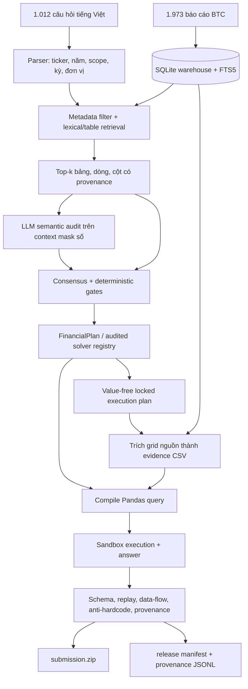

# Kiến trúc hệ thống

## Phân lớp solver

| Block | ID | Logic |
| --- | --- | --- |
| L1 | 1–361 | single fact và đổi đơn vị |
| Advanced | 362–455 | tỷ số, screening, scenario và selector phức tạp |
| Screening/L4 | 456–577 | nhiều fact, filter, argmax/argmin |
| L2 temporal | 578–655 | difference/growth giữa hai kỳ |
| L2 formula | 656–732 | công thức tài chính nhiều fact |
| Cross entity | 733–812 | so sánh nhiều doanh nghiệp |
| L3 aggregate | 813–1012 | tổng hợp nhiều năm/doanh nghiệp |

Các block dùng chung `FactRetriever`, source-cell override, CSV exporter và
Pandas compiler. Release plan là kết quả compile của registry/audit: nó chỉ giữ
query, provenance và source checksum, không chứa answer hoặc giá trị tài chính.

## Retrieval

1. Lọc cứng ticker, year và report scope trước khi semantic scoring.
2. FTS/lexical score trên title, context, row label và header.
3. Rerank theo kỳ hiện tại/so sánh, đơn vị, hierarchy và semantic conflicts.
4. Giữ top-k candidate kèm `document_id`, `source_line_1`, row/column.
5. Với ca mơ hồ, LLM chỉ chọn trong candidate refs đã tồn tại.

## Execution và kiểm chứng

Query chạy trong namespace allowlist với `pd`, `float`, `int`, `str`, `abs` và
các dataframe evidence. Validator từ chối import, filesystem/network access,
method không được phép, query không đọc dataframe và phép nhân nguồn với zero.

Mỗi CSV phải khớp nguyên vẹn một `grid_json` của `relevant_tables`. Bản release
hiện replay 1.012/1.012 query và bind 5.941/5.941 CSV về 2.842 bảng BTC.
